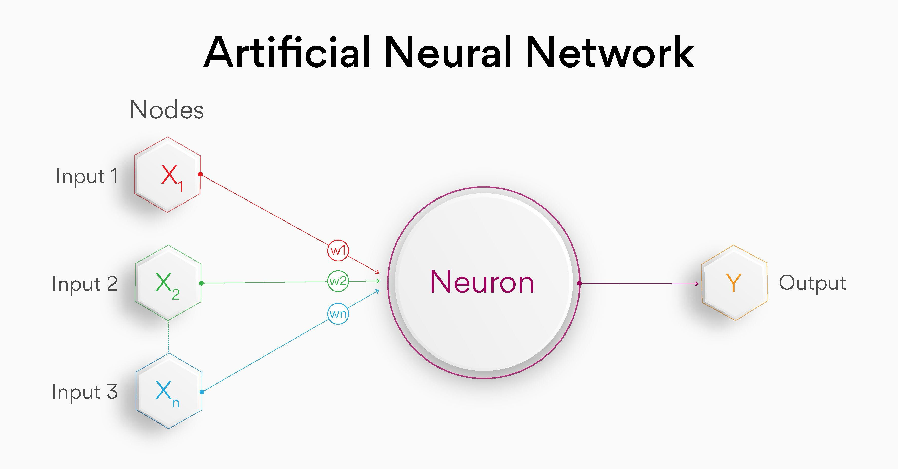
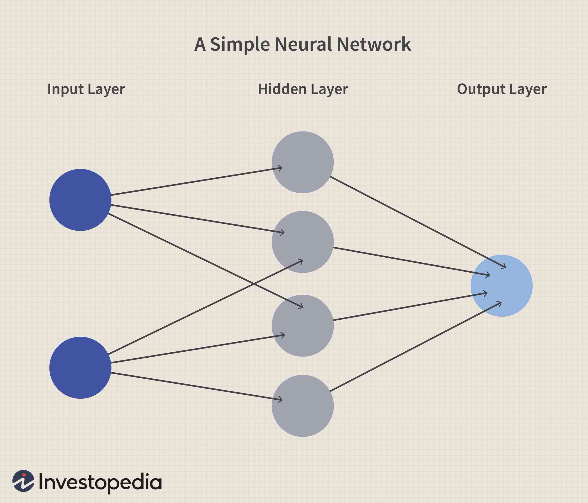

# Toyceptron


# Highlights

- Accurate simulation of a 3 layer neural network
- Implemented from a functional specification, building each component to match a predefined interface in `main.py`

# Overview

A Python implementation of a 3 layer neural network made from scratch, built as a student project at La Plateforme_ Marseille: the goal was to understand the fundamentals of neural networks by implementing forward propagation with no external libraries and no model training.

## Authors
- Eltigani ABDALLAH
- Rimma CHUKHNO

## Objectives

Constructing a simple neural network in order to learn the following:
- What is a neuron?
- How do layers function in the scope of a neural network?
- How does data flow in a neural network?
- The role of weights, biases and activation functions

## Constraints

- Python is the only language allowed
- No external libraries allowed
- Use lists to represent vectors
- No *back propagation*  so no network training

## Project structure

```
.
├── activation.py
├── layer.py
├── main.py
├── network.py
├── neuron.py
├── __pycache__
│   ├── activation.cpython-312.pyc
│   ├── layer.cpython-312.pyc
│   ├── network.cpython-312.pyc
│   ├── neuron.cpython-312.pyc
│   └── text_color.cpython-312.pyc
├── python.md
└── README.md

2 directories, 12 files
```
# How it works

## Neuron



A neuron in the scope of this exercise is a mathematical function that has three parameters: 

- Input
	- The value that will be processed by the neuron. X<sub>1,2,3</sub> in the image
- Weights
	- A measure of how *important* a certain piece of information is, more weight = more importance. W<sub>1,2,3</sub> in the image
- Bias
	- A value added to manually skew the result towards a certain value which is applied after all calculations are done.


The neuron's function can be explained as such: 
> ( weight × input ) + bias = output

this result will then be passed on to the next neuron in the network: a *forward pass* 

## Layer




A collection of neurons that take in the same set of inputs

A neural network consists of three types of layers:
 - Input
	 - Receives raw input data to integrate into the network
 - Hidden
	 - the layers that perform the computations required by the network, they can vary in number and size depending on the complexity of the task, and each layer applies a set of weights and biases to the input data, then applies an activation function to introduce non-linearity
 - Output
	 - the layer that produces the output predictions, the number of neurons corresponds to the number of classes in a classification problem or the number of outputs in a regression problem

## Network

A machine learning model that consists of neurons stacked in layers where raw data goes into the input layer, gets processed by the hidden layers, then is returned through the output layers to create a prediction.


# Installation

To run the test file (in this case `main.py`) you need to have Python installed from [here](https://www.python.org/downloads/). This exercise was created in python 3.12 for reference, though it is recommended to install the latest release.

Once that is done, you may run the application by opening a terminal in the folder and calling python3 to run main.py, that will show the results of the exercise.

```
path/to/main$ python3 main.py
``` 

> Sometimes `python3` doesn't work, you may try `py` or `python` depending on your installation of python


# Output

> Note: output labels are in French because the school is in France


Since `main.py` is a hard-coded example/unit test, you will see the following output if the exercise is done correctly, which matches the results in the `main.py` comments:

```

Input: [1.0, 2.0, 4.0]

--- Test Neuron ---
Neurone h1 (brut): 1.6
Neurone h2 (brut): 0.7
Neurone h1 (activé): 0.8320183851339245
Neurone h2 (activé): 0.6681877721681662

--- Test Layer ---
Couche (valeurs brutes): [1.6, 0.7]
Couche (valeurs activées): [0.8320183851339245, 0.6681877721681662]

--- Test Network ---

Sorties activées : [0.5309442148001715, 0.494901997674804]

Couche 1 (valeurs brutes): [1.6, 0.7]
Couche 1 (valeurs activées): [0.8320183851339245, 0.6681877721681662]

Couche 2 (valeurs brutes): [0.282371638133329, 0.11766959332708915, 0.1168393929470257]
Couche 2 (valeurs activées): [0.5701275664660839, 0.5293835021627928, 0.5291766638208738]

Couche 3 (valeurs brutes): [0.12393525248772061, -0.020392715985837397]
Couche 3 (valeurs activées): [0.5309442148001715, 0.494901997674804]

```

